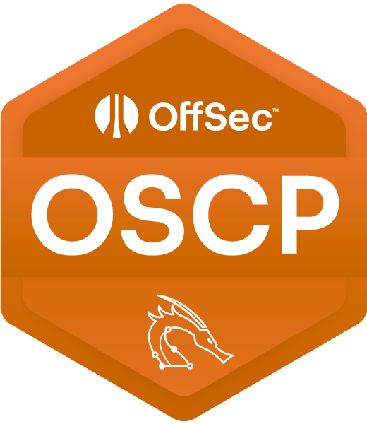

# OSCP Notes

   

## Overview
This vault contains my personal notes, cheat sheets, and templates for the **Offensive Security Certified Professional (OSCP)** exam.  
It’s meant for **study and practice only** — not a replacement for official materials.

## Structure (TBD)
- **cheatsheets/** → quick commands & snippets (nmap, smb, privesc, etc.)
- **walkthroughs/** → example machine writeups (non-lab specific)
- **templates/** → exam & lab report templates
- **tools/** → helper scripts
- **references/** → useful links & resources

## Usage
1. Clone/download the repo.  
2. Open it in [Obsidian](https://obsidian.md/).  
3. Enable **Outline** plugin for quick navigation.  
4. (Optional) Install **Copy Inline Code** to copy commands with one click.  

## Disclaimer
Educational use only. Do **not** share real OSCP lab/exam solutions. Unauthorized hacking is illegal.  

## References
- [OSCP Official Page](https://www.offsec.com/courses/pen-200/)  
- Public privesc & pentesting cheat sheets (see `references/`)  

---

> ⚡ Tip: Use the Outline view (`Cmd/Ctrl + P → Outline: Show Outline`) to quickly jump between sections.
